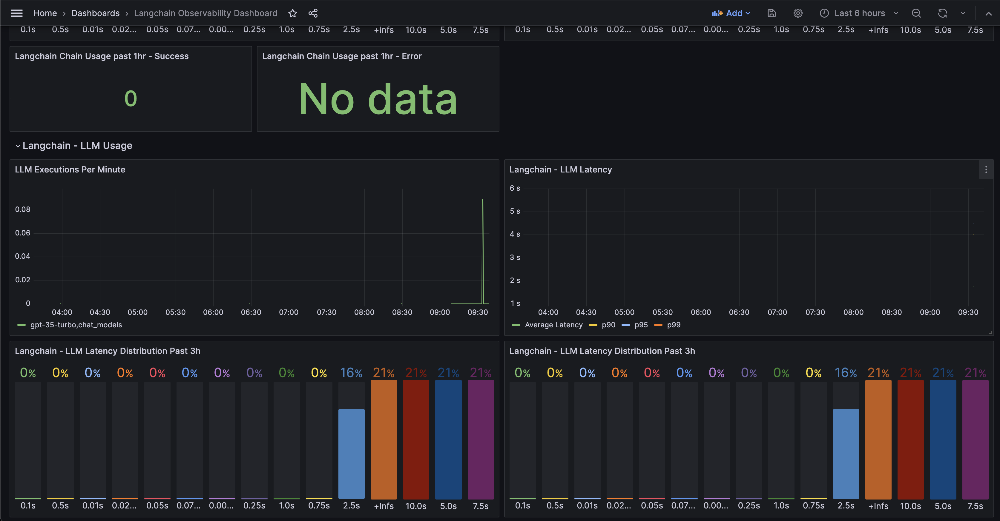
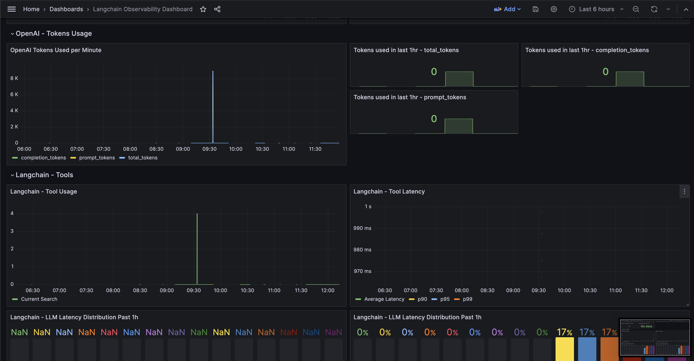
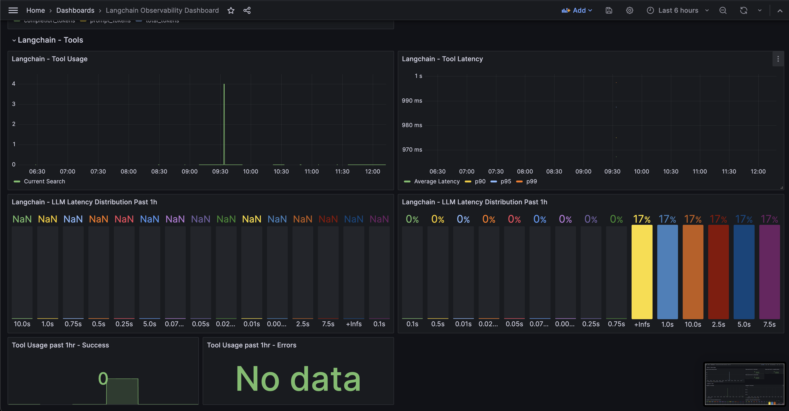

## Langchain Documentation

### Basic Usage
```python
from xpuls.mlmonitor.langchain.instrument import LangchainTelemetry

# Add default labels that will be added to all captured metrics
default_labels = {"service": "ml-project-service", "k8s-cluster": "app0", "namespace": "dev",  
                  "agent_name": "fallback_value"}

# Enable the auto-telemetry
LangchainTelemetry(default_labels=default_labels).auto_instrument()

```

### Advanced Guide
#### 1. Decorator for overriding default labels 
Can be used in LLM Apps which have multi-agent in the workflow [Optional] 

Only labels defined can be overriden, if you wish you add a new label, then it needs to defined in `default_labels`
```python
# Overriding value `agent_nam`e defined in `default_labels`
@TelemetryOverrideLabels(agent_name="chat_agent_alpha")  # `agent_name` here is overriden for the scope of this function 
def get_response_using_agent_alpha(prompt, query):
    agent = initialize_agent(llm=chat_model,
                             verbose=True,
                             agent=CONVERSATIONAL_REACT_DESCRIPTION,
                             memory=memory)

    res = agent.run(f"{prompt}. \n Query: {query}")
```

## Monitoring

We have created a template grafana dashboard setup for you to get started.

You can find the dashboard template here -> [grafana template](../dashboards/grafana_langchain.json)

### Screenshots

|   |   |
|---|---|
|   |   |


`Note`: "No Data" for few fields in the screenshot is because of unavailability of data at the point of taking the screenshot, so it shouldn't be an issue.